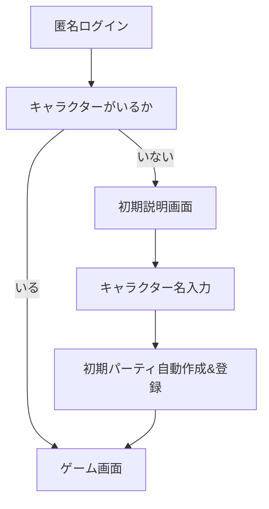
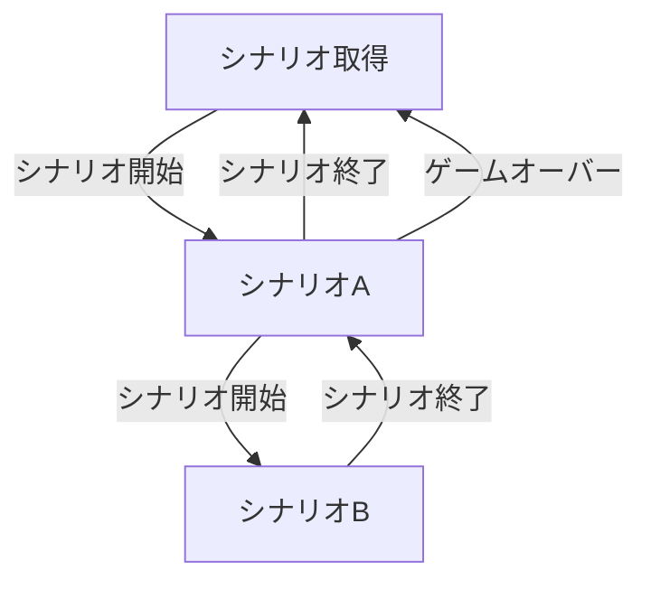
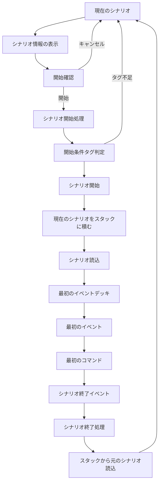

## 状態遷移図

### ログイン ― 初期入力

## シナリオの状態

### シナリオの読込
C[現在のシナリオをスタックに積む]

---

## 参考

[mermaid](https://mermaid-js.github.io/mermaid/#/stateDiagram)
[vscode+mermaid](https://www.agent-grow.com/self20percent/2020/03/05/%E4%BD%BF%E3%81%A3%E3%81%A6%E3%81%BF%E3%82%88%E3%81%86%EF%BC%81vscodemermaid/)
