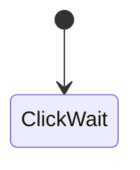

## 目次

```toc
# This code block gets replaced with the TOC
exclude: Table of Contents
tight: false
ordered: false
from-heading: 2
to-heading: 6
class-name: "table-of-contents"
```

## コマンド

最小の単位。以下の種類がある

| コマンド           | 説明                                                                 |
| ------------------ | -------------------------------------------------------------------- |
| テキスト           | 文字を表示する。画面クリックによって次のコマンド。                   |
| 選択肢             | 選択肢を表示する。                                                   |
| 入力待ち           | 入力待ち状態にする                                                   |
| リンクキャプション | リンク説明                                                           |
| リンク             | 次のイベントへ遷移                                                   |
| タグ分岐           | パーティのタグを判定して次のコマンド。TODO: キャラクタ判定           |
| タグ取得           | パーティ/キャラクターにタグを付与する                                |
| タグ廃棄           | パーティ/キャラクターからタグを除去する                              |
| シナリオ開始       | 現在のシナリオを開始する                                             |
| シナリオ終了       | シナリオを終了する                                                   |
| キャラクター追加   | キャラクターをパーティに追加する                                     |
| 確認               | OK で次のイベント、キャンセルで元の状態に戻る                        |
| ジャンプ           | 次のイベントへ遷移                                                   |
| コール             | 現在のイベントを中断して別のイベントを読み込む。終わったらもとに戻る |

### 状態遷移


