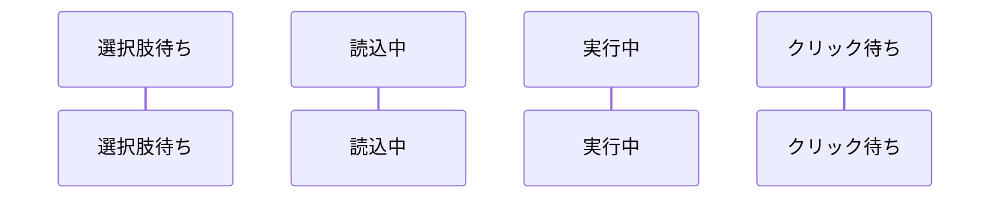

```toc
# This code block gets replaced with the TOC
exclude: Table of Contents
tight: false
ordered: false
from-heading: 2
to-heading: 6
class-name: "table-of-contents"
```

```toc
# This code block gets replaced with the TOC
```

## 目次

```toc
# This code block gets replaced with the TOC
```


