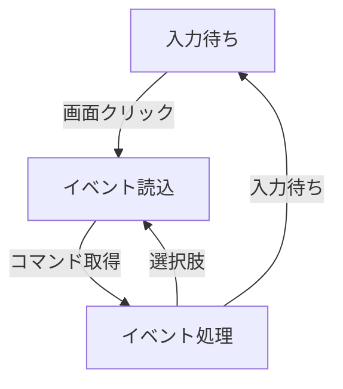

## 概要
選択肢を表示する

### パラメータ

パラメータ|必須|解説
--|--|--
next|〇|選択後のコマンド
requireTag||指定のタグを所持している場合のみ表示

### 状態

```mermaid
flowchart TD
    A[入力待ち] -->|画面クリック| B[イベント読込]
    B -->|コマンド取得| C[イベント処理]
    C -->|選択肢| B
    C -->|入力待ち|A
```

