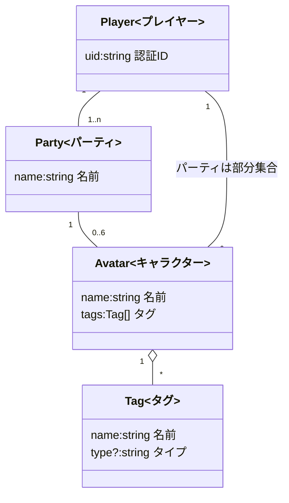
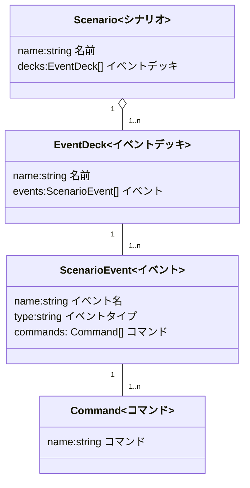

## プレイヤーとキャラクター

```mermaid

classDiagram
    class Avatar~キャラクター~{
      name:string 名前
      tags:Tag[] タグ
    }
    class Tag~タグ~{
      name:string 名前
      type?:string タイプ
    }
    class Party~パーティ~{
      name:string 名前
    }
    class Player~プレイヤー~{
      uid:string 認証ID
    }

    Avatar "1" o-- "*" Tag
    Party "1" -- "0..6" Avatar
    Player "1" -- "1..n" Party
    Player "1" -- "*" Avatar : パーティは部分集合
```

## シナリオとイベント

```mermaid

classDiagram
    class Scenario~シナリオ~{
      name:string 名前
      decks:EventDeck[] イベントデッキ
    }
    class EventDeck~イベントデッキ~{
      name:string 名前
      events:ScenarioEvent[] イベント
    }
    class ScenarioEvent~イベント~{
      name:string イベント名
      type:string イベントタイプ
      commands: Command[] コマンド
    }
    class Command~コマンド~{
      name:string コマンド
    }

    Scenario "1" o-- "1..n" EventDeck
    EventDeck "1" -- "1..n" ScenarioEvent
    ScenarioEvent "1" -- "1..n" Command
```
